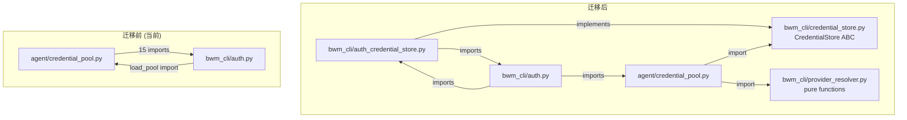

# P2-2: agent <-> bwm_cli Layer Violation — Migration Plan

> 审查日期: 2026-05-06
> 审计编号: C-3 / P2-2
> 违规类型: 双向跨层耦合 (violation of architecture layer boundaries)
> 涉及文件: agent/credential_pool.py (1497 行), bwm_cli/auth.py (4398 行)
> 严重级别: HIGH (架构层面, 影响可测试性、可部署性和重构安全性)

---

## 执行摘要

`agent/credential_pool.py` (agent 层) 和 `bwm_cli/auth.py` (CLI 层) 之间存在密集的双向导入循环。agent 层导入 15 个来自 CLI 层的符号 (其中 9 个是私有符号 `_*`), CLI 层反向导入 agent 层的 `load_pool` 和多个 adapter 模块。这种耦合使得:

- **无法独立测试 agent 层** — CredentialPool 测试必须承载完整的 CLI 环境 (auth.json 文件锁、provider 注册表、config.yaml)
- **无法独立部署 agent 层** — 任何 agent 代码变更都可能破坏 CLI
- **重构风险极高** — auth.json 格式变更需同时修改两个层的代码
- **循环导入脆弱** — 依赖严格的 import 顺序和延迟导入来避免 `ImportError`

**修复策略**: 引入 `bwm_cli/credential_store.py` 协议层 (Protocol/ABC), 将 agent 层需要的持久化操作抽象为接口, 通过依赖注入消除 agent 对 CLI 实现的直接依赖。

---

## 1. 跨层导入清单: agent/credential_pool.py -> bwm_cli/

### 1.1 顶层显式导入 (agent/credential_pool.py:17-33)

| # | 行号 | 导入符号 | 可见性 | 使用位置 | 用途 |
|---|------|---------|--------|---------|------|
| 1 | 17 | `bwm_cli.auth` (as `auth_mod`) | 模块级导入 | :608 `auth_mod.refresh_codex_oauth_pure`, :636 `auth_mod.refresh_nous_oauth_from_state` | Codex OAuth 刷新 + BookwormPRO agent key mint |
| 2 | 19 | `CODEX_ACCESS_TOKEN_REFRESH_SKEW_SECONDS` | 公开常量 | :746 `_entry_needs_refresh()` | 判断 Codex access_token 是否即将过期 |
| 3 | 20 | `DEFAULT_AGENT_KEY_MIN_TTL_SECONDS` | 公开常量 | :638 `_refresh_entry()` | BookwormPRO agent key mint 最小 TTL |
| 4 | 21 | `PROVIDER_REGISTRY` | 公开数据 | :1180 `_seed_from_singletons()` | 查找 copilot 的 `inference_base_url` |
| 5 | 22 | `_auth_store_lock` | **私有** | :471, :528 `_sync_nous_entry_from_auth_store`, `_sync_device_code_entry_to_auth_store` | 跨进程文件锁保护 auth.json 读写 |
| 6 | 23 | `_codex_access_token_is_expiring` | **私有** | :744 `_entry_needs_refresh()` | JWT exp 声明解析 + 到期判断 |
| 7 | 24 | `_decode_jwt_claims` | **私有** | :173 `label_from_token()` | 从 OAuth token 中提取 email/username 作为凭证标签 |
| 8 | 25 | `_load_auth_store` | **私有** | :472, :529, :1076 | 读取 `~/.bookwormpro/auth.json` |
| 9 | 26 | `_load_provider_state` | **私有** | :473, :531, :554, :1123, :1234 | 从 auth store 中提取指定 provider 的 state dict |
| 10 | 27 | `_resolve_kimi_base_url` | **私有** | :1367 `_seed_from_env()` | 根据 api_key 前缀判断 kimi 国内/国际 endpoint |
| 11 | 28 | `_resolve_zai_base_url` | **私有** | :1369 `_seed_from_env()` | 智谱 API key 前缀路由 |
| 12 | 29 | `_save_auth_store` | **私有** | :570 `_sync_device_code_entry_to_auth_store` | 将修改后的 auth store 写回 auth.json |
| 13 | 30 | `_save_provider_state` | **私有** | :551, :565 `_sync_device_code_entry_to_auth_store` | 更新 auth store 中单个 provider 的 state |
| 14 | 31 | `read_credential_pool` | 公开函数 | :324 `list_custom_pool_providers()`, :1477 `load_pool()` | 读取 auth.json 中 credential_pool 段 |
| 15 | 32 | `write_credential_pool` | 公开函数 | :396, :1493 | 将 pool entries 写回 auth.json |

### 1.2 延迟导入 (模块函数体内)

| # | 行号 | 导入 | 类别 |
|---|------|------|------|
| 16 | 41 | `from bwm_cli.config import load_config` | bwm_cli |
| 17 | 291 | `from bwm_cli.config import get_compatible_custom_providers` | bwm_cli |
| 18 | 1081, 1271, 1409 | `from bwm_cli.auth import is_source_suppressed` (3 处) | bwm_cli |
| 19 | 1092 | `from bwm_cli.auth import is_provider_explicitly_configured` | bwm_cli |
| 20 | 1173 | `from bwm_cli.copilot_auth import resolve_copilot_token, get_copilot_api_token` | bwm_cli |
| 21 | 1203 | `from bwm_cli.auth import resolve_qwen_runtime_credentials` | bwm_cli |

### 1.3 反向导入: bwm_cli/auth.py -> agent/

| # | 行号 | 导入 | 用途 |
|---|------|------|------|
| A | 1234, 3479 | `from agent.bedrock_adapter import has_aws_credentials` | AWS 凭证链检测 |
| B | 1497 | `from agent.google_oauth import GoogleOAuthError, _credentials_path, get_valid_access_token, load_credentials` | Gemini OAuth 凭证解析 |
| C | 1536 | `from agent.google_oauth import _credentials_path, load_credentials` | Gemini auth 状态查询 |
| D | 2964, 3254, 3356 | `from agent.credential_pool import load_pool` | BookwormPRO/Codex auth 状态 snapshot |

**结论**: 双向耦合已形成硬循环 — `agent/credential_pool.py` 和 `bwm_cli/auth.py` 互相依赖，无法独立存在。

---

## 2. CredentialStore 协议设计

### 2.1 设计目标

将 agent 层对 auth.json 的 5 类操作抽象为协议接口，使 agent 层只依赖抽象而非具体实现:

1. **凭证池读写** (`read_credential_pool` / `write_credential_pool`)
2. **Auth store 读写** (`_load_auth_store` / `_save_auth_store`)
3. **Provider state 读写** (`_load_provider_state` / `_save_provider_state`)
4. **Source 抑制检查** (`is_source_suppressed`)
5. **Provider 显式配置检查** (`is_provider_explicitly_configured`)

### 2.2 新增文件: `bwm_cli/credential_store.py`

```python
"""CredentialStore protocol — decouples agent layer from auth.json persistence."""

from __future__ import annotations

from abc import ABC, abstractmethod
from contextlib import contextmanager
from typing import Any, Dict, List, Optional, Protocol, Tuple

# ---------------------------------------------------------------------------
# Type aliases
# ---------------------------------------------------------------------------

AuthStore = Dict[str, Any]
ProviderState = Dict[str, Any]
PoolEntry = Dict[str, Any]


class CredentialStore(ABC):
    """Abstract interface for auth.json-backed credential persistence.

    The agent layer consumes this interface via dependency injection, never
    importing bwm_cli.auth directly.  Real implementations live in bwm_cli/;
    tests supply lightweight in-memory fakes.

    Every method that reads or writes the auth store MUST acquire the
    store-wide file lock before operating.  Callers receive the lock
    as a context manager.
    """

    # ---- Lock ----------------------------------------------------------

    @abstractmethod
    @contextmanager
    def auth_store_lock(self, timeout_seconds: float = 15.0):
        """Acquire the cross-process advisory lock protecting auth.json.

        Yields nothing; the lock is held for the duration of the ``with``
        block.  Implementations may use fcntl (POSIX) or msvcrt (Windows).
        """
        ...

    # ---- Auth store read / write ---------------------------------------

    @abstractmethod
    def load_auth_store(self) -> AuthStore:
        """Return the full contents of auth.json (or empty dict if missing)."""
        ...

    @abstractmethod
    def save_auth_store(self, store: AuthStore) -> None:
        """Atomically write *store* back to auth.json."""
        ...

    # ---- Provider state ------------------------------------------------

    @abstractmethod
    def load_provider_state(self, provider_id: str) -> Optional[ProviderState]:
        """Extract the ``providers.<provider_id>`` sub-dict from the auth store.

        Returns None when the provider has no stored state.
        """
        ...

    @abstractmethod
    def save_provider_state(
        self, provider_id: str, state: ProviderState
    ) -> None:
        """Persist *state* under ``providers.<provider_id>``.

        Must be called while holding ``auth_store_lock``.
        """
        ...

    # ---- Credential pool -----------------------------------------------

    @abstractmethod
    def read_credential_pool(
        self, provider_id: Optional[str] = None
    ) -> Dict[str, List[PoolEntry]]:
        """Read the ``credential_pool`` section of auth.json.

        When *provider_id* is None, return the whole pool dict.
        Otherwise return ``{provider_id: [...]}`` (empty list if missing).
        """
        ...

    @abstractmethod
    def write_credential_pool(
        self, provider_id: str, entries: List[PoolEntry]
    ) -> None:
        """Write *entries* for *provider_id* into the credential pool.

        Must be called while holding ``auth_store_lock``.
        """
        ...

    # ---- Source management ---------------------------------------------

    @abstractmethod
    def is_source_suppressed(self, provider_id: str, source: str) -> bool:
        """Return True if *source* was removed by the user for *provider_id*.

        Suppressed sources are skipped during auto-seeding.
        """
        ...

    # ---- Provider configuration ----------------------------------------

    @abstractmethod
    def is_provider_explicitly_configured(self, provider_id: str) -> bool:
        """Return True if *provider_id* appears in config.yaml or .env.

        Used as a consent gate before auto-discovering external credentials
        (e.g. ~/.claude/.credentials.json).
        """
        ...


class CredentialStoreProvider(Protocol):
    """Callable that returns a CredentialStore instance.

    Allows dependency injection without a DI container:
        def load_pool(provider: str, *, store: CredentialStore | None = None):
            store = store or _default_store()

    In tests:
        load_pool("anthropic", store=FakeCredentialStore(...))
    """
    def __call__(self) -> CredentialStore: ...
```

### 2.3 默认实现: `bwm_cli/auth_credential_store.py`

```python
"""Real CredentialStore backed by bwm_cli.auth primitives."""

from bwm_cli.credential_store import CredentialStore, AuthStore, PoolEntry
from bwm_cli.auth import (
    _auth_store_lock,
    _load_auth_store,
    _save_auth_store,
    _load_provider_state,
    _save_provider_state,
    read_credential_pool,
    write_credential_pool,
    is_source_suppressed,
    is_provider_explicitly_configured,
)

class AuthCredentialStore(CredentialStore):
    """Production CredentialStore wrapping bwm_cli.auth persistence."""

    def auth_store_lock(self, timeout_seconds=15.0):
        return _auth_store_lock(timeout_seconds)

    def load_auth_store(self):       return _load_auth_store()
    def save_auth_store(self, s):    _save_auth_store(s)
    def load_provider_state(self, p): return _load_provider_state(self.load_auth_store(), p)
    def save_provider_state(self, p, s):
        store = self.load_auth_store()
        _save_provider_state(store, p, s)
        _save_auth_store(store)

    def read_credential_pool(self, p=None):     return read_credential_pool(p)
    def write_credential_pool(self, p, e):      write_credential_pool(p, e)
    def is_source_suppressed(self, p, s):       return is_source_suppressed(p, s)
    def is_provider_explicitly_configured(self, p): return is_provider_explicitly_configured(p)


# Module-level singleton for default usage
_default_store: Optional[CredentialStore] = None

def get_default_credential_store() -> CredentialStore:
    global _default_store
    if _default_store is None:
        _default_store = AuthCredentialStore()
    return _default_store

def set_default_credential_store(store: CredentialStore) -> None:
    global _default_store
    _default_store = store
```

### 2.4 替代实现: 测试用 `FakeCredentialStore`

```python
"""In-memory fake for agent-layer tests."""

class FakeCredentialStore(CredentialStore):
    def __init__(self, initial_auth_store=None, initial_pool=None):
        self._store = dict(initial_auth_store or {})
        self._pool = dict(initial_pool or {})
        self._suppressed = set()  # (provider, source)
        self._explicit = set()    # provider ids

    @contextmanager
    def auth_store_lock(self, timeout_seconds=15.0):
        yield  # no-op in tests

    def load_auth_store(self):          return self._store.copy()
    def save_auth_store(self, s):       self._store = s
    def load_provider_state(self, p):   return self._store.get("providers", {}).get(p)
    def save_provider_state(self, p, s):
        self._store.setdefault("providers", {})[p] = s
    def read_credential_pool(self, p=None):
        if p is None: return self._pool
        return {p: self._pool.get(p, [])}
    def write_credential_pool(self, p, e): self._pool[p] = e
    def is_source_suppressed(self, p, s):  return (p, s) in self._suppressed
    def is_provider_explicitly_configured(self, p): return p in self._explicit
```

---

## 3. 依赖注入策略

### 3.1 核心原则

- **agent 层只导入 `bwm_cli/credential_store.py` (协议文件)**, 不再导入 `bwm_cli/auth.py`
- **bwm_cli 层负责在运行时注入 `AuthCredentialStore`**
- 所有 agent 函数接受 `store: Optional[CredentialStore] = None` 参数, `None` 时使用全局默认

### 3.2 agent/credential_pool.py 改造模式

改造前:
```python
from bwm_cli.auth import _load_auth_store, _save_auth_store, ...

def _seed_from_singletons(provider, entries):
    auth_store = _load_auth_store()
    state = _load_provider_state(auth_store, "bookwormpro")
    ...
```

改造后:
```python
from bwm_cli.credential_store import CredentialStore, get_default_credential_store

def _seed_from_singletons(provider, entries, *, store=None):
    if store is None:
        store = get_default_credential_store()
    auth_store = store.load_auth_store()
    state = store.load_provider_state("bookwormpro")
    ...
```

### 3.3 bwm_cli/auth.py 调用方改造

改造前 (line 2964):
```python
def persist_nous_credentials(creds, *, label=None):
    from agent.credential_pool import load_pool
    ...
```

改造后:
```python
def persist_nous_credentials(creds, *, label=None):
    from agent.credential_pool import load_pool
    from bwm_cli.auth_credential_store import AuthCredentialStore
    store = AuthCredentialStore()
    pool = load_pool("bookwormpro", store=store)
    ...
```

### 3.4 依赖反转示意图

```
          迁移前                           迁移后
  ┌──────────────────┐            ┌──────────────────────────┐
  │  agent/          │            │  agent/                  │
  │  credential_pool │            │  credential_pool         │
  │        │         │            │        │                 │
  │        ▼         │            │        ▼                 │
  │  bwm_cli/auth.py │            │  bwm_cli/credential_store│
  │  (15 imports)    │            │  (ABC only, no impl)     │
  └──────────────────┘            └──────────────────────────┘
             ▲                                  ▲
             │                                  │
  ┌──────────────────┐            ┌──────────────────────────┐
  │  bwm_cli/auth.py │            │  bwm_cli/auth.py         │
  │  (imports agent/) │            │  + auth_credential_store │
  └──────────────────┘            │  (implements ABC)        │
                                  └──────────────────────────┘
```

---

## 4. Provider 解析提取计划

### 4.1 当前耦合点分析

agent/credential_pool.py 中包含 provider 特定的解析逻辑, 这些逻辑嵌在池加载过程中:

| 函数 | 当前耦合 | 目标 |
|------|---------|------|
| `_seed_from_singletons()` | 直接调用 `_load_provider_state`, `PROVIDER_REGISTRY` | 通过 `store` 参数间接访问 |
| `_seed_from_env()` | 直接调用 `_resolve_kimi_base_url`, `_resolve_zai_base_url`, `PROVIDER_REGISTRY` | 提取 base_url 解析为独立纯函数, 移入 `bwm_cli/provider_resolver.py` |
| `_refresh_entry()` | 直接调用 `auth_mod.refresh_codex_oauth_pure`, `auth_mod.refresh_nous_oauth_from_state`, `DEFAULT_AGENT_KEY_MIN_TTL_SECONDS` | 通过 `CredentialRefresher` 协议注入 |
| `_sync_nous_entry_from_auth_store()` | 直接访问 `_auth_store_lock`, `_load_auth_store`, `_load_provider_state` | 通过 `store.auth_store_lock()` + `store.load_provider_state()` |
| `_sync_device_code_entry_to_auth_store()` | 直接调用 `_save_provider_state`, `_save_auth_store` | 通过 `store.save_provider_state()` + `store.save_auth_store()` |

### 4.2 新增: `bwm_cli/provider_resolver.py` (提取纯函数)

将以下纯函数从 `bwm_cli/auth.py` 中提取为独立模块, 使它们可以被 agent 层安全导入(不引入 auth.json 依赖):

| 函数 | 行号 | 描述 |
|------|------|------|
| `_resolve_kimi_base_url` | auth.py:412 | Kimi 国内/国际 endpoint 路由 |
| `_resolve_zai_base_url` | auth.py:539 | 智谱 API key 前缀路由 |
| `_decode_jwt_claims` | auth.py:1291 | JWT payload 解码 (base64 decode, 无网络) |
| `_codex_access_token_is_expiring` | auth.py:1304 | Codex access_token exp 检查 |

这些函数是**纯逻辑**, 不依赖文件系统或网络, 提取后 agent 层可以直接导入。

---

## 5. 迁移阶段

### Phase 1: 协议定义 (0.5 天)

**目标**: 创建 `CredentialStore` ABC 和 `FakeCredentialStore`, 不改动任何现有代码。

**任务**:
1. [x] 创建 `bwm_cli/credential_store.py` — CredentialStore ABC + 类型别名
2. [x] 创建 `tests/agent/fake_credential_store.py` — FakeCredentialStore 实现
3. [ ] 添加 `FakeCredentialStore` 的单元测试

**验证**: `python -c "from bwm_cli.credential_store import CredentialStore"` 成功
**回滚**: `git checkout -- bwm_cli/credential_store.py tests/agent/fake_credential_store.py`

### Phase 2: 实现层 (0.5 天)

**目标**: 创建 `AuthCredentialStore`, 验证与现有 auth.py 的兼容性。

**任务**:
1. [ ] 创建 `bwm_cli/auth_credential_store.py` — AuthCredentialStore 实现
2. [ ] 在 `tests/bwm_cli/` 中添加 `test_auth_credential_store.py` — 集成测试
3. [ ] 验证: FakeCredentialStore 和 AuthCredentialStore 对相同输入产生相同输出

**验证**: 运行 `pytest tests/bwm_cli/test_auth_credential_store.py -v`
**回滚**: `git checkout -- bwm_cli/auth_credential_store.py tests/bwm_cli/test_auth_credential_store.py`

### Phase 3: CredentialPool 内部函数迁移 (1 天)

**目标**: 将 `agent/credential_pool.py` 中所有内部函数改为接受 `store` 参数, 但不修改公开 API。

**任务**:
1. [ ] `label_from_token()` — 将 `_decode_jwt_claims` 改为参数传入或移至 `provider_resolver.py`
2. [ ] `_sync_nous_entry_from_auth_store()` — 接受 `store` 参数
3. [ ] `_sync_device_code_entry_to_auth_store()` — 接受 `store` 参数
4. [ ] `_seed_from_singletons()` — 接受 `store` 参数
5. [ ] `_seed_from_env()` — 接受 `store` 参数 (base_url 解析)
6. [ ] `_seed_custom_pool()` — 接受 `store` 参数
7. [ ] `_refresh_entry()` — 接受可选的 `refresher` callable 参数, 保留现有 `auth_mod.refresh_*` 作为默认值
8. [ ] `load_pool()` — 接受 `store=None` 参数, 向下传递
9. [ ] 保留所有现有函数签名作为兼容层(wrapper 调用新签名, 传入 `get_default_credential_store()`)

**验证**: 运行 `pytest tests/agent/test_credential_pool.py -v` 全部通过
**回滚**: `git checkout -- agent/credential_pool.py`

### Phase 4: 消除顶层导入 (0.5 天)

**目标**: 移除 `agent/credential_pool.py:17-33` 的 15 个顶层导入, 替换为协议导入。

**任务**:
1. [ ] 替换 `import bwm_cli.auth as auth_mod` → 通过 `refresher` callable 注入
2. [ ] 替换 `from bwm_cli.auth import (...)` → 通过 `store` 参数 + `provider_resolver.py` 纯函数
3. [ ] 保留模块级 `get_default_credential_store` 延迟初始化作为 fallback
4. [ ] 运行完整测试套件

**验证**: `grep -c "from bwm_cli.auth import\|import bwm_cli.auth" agent/credential_pool.py` 返回 0
**回滚**: `git stash` (单文件回滚)

### Phase 5: bwm_cli/auth.py 反向导入清理 (0.5 天)

**目标**: 移除 `bwm_cli/auth.py` 中对 `agent/credential_pool` 的 3 处导入, 改为使用本地 `AuthCredentialStore` + agent 公共 API。

**任务**:
1. [ ] `persist_nous_credentials()` (line 2964) — 传入 `AuthCredentialStore()` 给 `load_pool`
2. [ ] `_snapshot_nous_pool_status()` (line 3254) — 同上述
3. [ ] `get_codex_auth_status()` (line 3356) — 同上述
4. [ ] (可选) 将 `has_aws_credentials` 和 `google_oauth` 导入保留为延迟导入 (这些不是循环问题, 只是跨层)
5. [ ] 运行完整测试套件

**验证**: `grep "from agent.credential_pool import" bwm_cli/auth.py` 返回 0
**回滚**: `git stash`

### Phase 6: Provider 解析提取 (0.5 天)

**目标**: 创建 `bwm_cli/provider_resolver.py`, 移动纯函数。

**任务**:
1. [ ] 创建 `bwm_cli/provider_resolver.py`
2. [ ] 移动 `_resolve_kimi_base_url`, `_resolve_zai_base_url`, `_decode_jwt_claims`, `_codex_access_token_is_expiring`
3. [ ] 在 `bwm_cli/auth.py` 中保留 re-export (保持向后兼容)
4. [ ] 更新 `agent/credential_pool.py` 的导入路径

**验证**: 所有现有测试通过; `provider_resolver.py` 中无文件 I/O 或网络调用
**回滚**: `git checkout -- bwm_cli/provider_resolver.py`

### Phase 7: 文档与监控 (0.5 天)

**目标**: 添加导入守卫, 更新架构文档。

**任务**:
1. [ ] 在 `agent/credential_pool.py` 顶部添加 `__layer__` 标记
2. [ ] 添加 pre-commit hook: 禁止 `agent/` 目录下直接 `import bwm_cli.auth`
3. [ ] 添加架构测试: `tests/architecture/test_layer_boundaries.py` 验证无跨层导入
4. [ ] 更新 BookwormPRO Architecture 文档

**验证**: pre-commit hook 阻止新违规; 架构测试通过
**回滚**: `git checkout -- .pre-commit-config.yaml tests/architecture/`

---

## 6. 验证检查清单

### 6.1 功能正确性

- [ ] `load_pool("anthropic")` 行为与迁移前完全一致
- [ ] `load_pool("bookwormpro")` 行为一致 (OAuth 刷新、agent key mint)
- [ ] `load_pool("openai-codex")` 行为一致 (Codex token 过期检测)
- [ ] `load_pool("openrouter")` 行为一致 (env seed + 冲突检测)
- [ ] `load_pool("custom:*")` 行为一致 (custom_providers 种子)
- [ ] `load_pool("copilot")` 行为一致 (gh CLI token 解析)
- [ ] `load_pool("qwen-oauth")` 行为一致 (qwen CLI credentials)
- [ ] `_seed_from_env()` kimi/zai base_url 解析正确
- [ ] `_sync_nous_entry_from_auth_store` 跨进程 token 同步正确
- [ ] `_sync_device_code_entry_to_auth_store` 写回正确
- [ ] `label_from_token` JWT 解码正确 (email/preferred_username/upn)
- [ ] `_exhausted_ttl` 429 vs 默认冷却时间正确
- [ ] `_prune_stale_seeded_entries` 清理逻辑正确

### 6.2 并发安全

- [ ] 2 个进程同时 `load_pool("bookwormpro")` 不会产生竞态
- [ ] `_auth_store_lock` 获取/释放正确 (POSIX fcntl + Windows msvcrt)
- [ ] `FakeCredentialStore.auth_store_lock` 为 no-op 不影响测试

### 6.3 向后兼容

- [ ] `from agent.credential_pool import load_pool` 仍然可用 (默认 store)
- [ ] `CredentialPool` 类公开 API 不变
- [ ] `read_credential_pool` / `write_credential_pool` 在 bwm_cli.auth 中保留
- [ ] 不改变 auth.json 格式

### 6.4 错误处理

- [ ] `FakeCredentialStore` 产生与 `AuthCredentialStore` 相同的异常类型
- [ ] `load_pool` 在 store 不可用时优雅降级 (返回空池)
- [ ] 所有 `except ImportError` 守卫保留

### 6.5 测试覆盖

- [ ] `FakeCredentialStore` 单元测试: 覆盖率 >= 95%
- [ ] `AuthCredentialStore` 集成测试: 覆盖率 >= 90%
- [ ] `agent/credential_pool.py` 现有测试全部通过 (无需修改)
- [ ] 新增架构边界测试: `tests/architecture/test_layer_boundaries.py`

---

## 7. 风险评估

| 风险 | 概率 | 影响 | 缓解措施 |
|------|------|------|---------|
| `refresh_nous_oauth_from_state` 和 `refresh_codex_oauth_pure` 的 `refresher` callable 注入导致行为差异 | 低 | 高 | Phase 3 保留默认路径 (调用现有 `auth_mod.refresh_*`), 仅新增可选参数 |
| `_auth_store_lock` 上下文管理器在 `FakeCredentialStore` 中缺少真实锁语义, 测试无法捕获竞态 | 中 | 中 | Phase 2 保留集成测试 (`AuthCredentialStore`), 单元测试用 fake, 竞态测试用真实 store |
| 循环导入在迁移中间态触发 | 中 | 高 | 每个 phase 独立可运行; 延迟导入作为安全网; CI 必须在每个 phase 后全绿 |
| `bwm_cli/auth.py` 中残留的对 agent 的导入无法一次性清理 | 中 | 低 | `has_aws_credentials` 和 `google_oauth` 导入保留 (非循环, 单向依赖, 后续单独处理) |
| 第三方插件/外部代码直接导入 `bwm_cli.auth` 私有符号 | 低 | 中 | 保留向后兼容 re-export 至少 2 个版本周期; 添加 deprecation warning |
| `provider_resolver.py` 提取的函数签名变化破坏调用方 | 低 | 低 | 在 `bwm_cli/auth.py` 中保留 re-export; 调用方无需变更 |

---

## 8. 工时汇总

| Phase | 任务 | 工时 | 可逆 |
|-------|------|------|------|
| 1 | 协议定义 | 0.5 天 | 是 |
| 2 | 实现层 | 0.5 天 | 是 |
| 3 | 内部函数迁移 | 1 天 | 是 |
| 4 | 消除顶层导入 | 0.5 天 | 是 |
| 5 | 反向导入清理 | 0.5 天 | 是 |
| 6 | Provider 解析提取 | 0.5 天 | 是 |
| 7 | 文档与监控 | 0.5 天 | 是 |
| **合计** | | **4 天** | |

---

## 9. 附录: 依赖图 (Mermaid)



---

> 生成时间: 2026-05-06
> 关联文档: C-3 Layer Violation Audit, code-quality-audit-phase2.md
